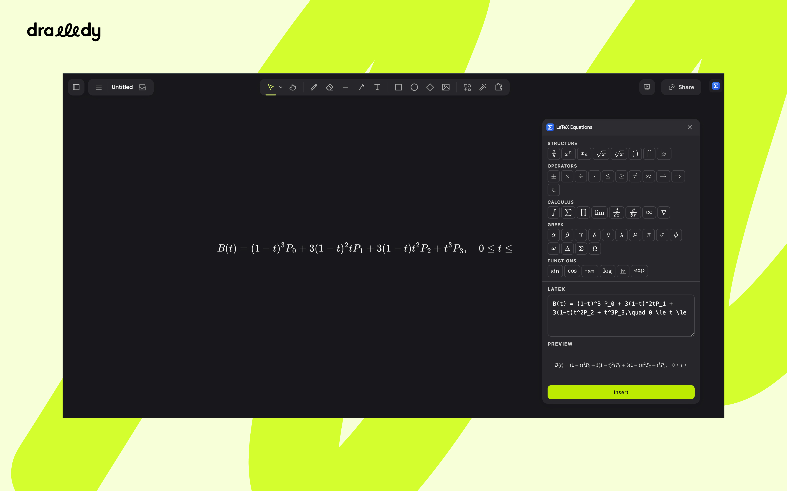

# LaTeX Equations for Drawdy

Write LaTeX in the side panel, watch it typeset as you type, and drop the
result onto your board as crisp vector art.

## Getting started

1. **Open the panel.** Click the blue **Σ** icon in the extension rail on the
   right of the board.
2. **Write an equation.** Type LaTeX into the box, or click any symbol key
   above it to insert that piece of TeX at the caret. The preview updates a
   moment after you stop typing.
3. **Put it on the board.** Press **Insert** (or `⌘` / `Ctrl` + `Enter`) to
   place it in the centre of your current view, or drag the preview out onto
   the canvas to drop it exactly where you want.

Close the panel from the rail whenever you like. Reopening it brings back
whatever you were working on.

## The panel

### Symbol keys

The rows at the top of the panel are one-click shortcuts. Each key inserts a
snippet at the caret and leaves the caret where you need to keep typing.

| Row           | What it holds                                                                 |
| ------------- | ----------------------------------------------------------------------------- |
| **Structure** | Fractions, superscripts, subscripts, roots, auto-sized brackets, absolute value |
| **Operators** | ±, ×, ÷, ·, ≤, ≥, ≠, ≈, →, ⇒, ∈                                                 |
| **Calculus**  | Integral, sum, product, limit, derivatives, ∞, ∇                                |
| **Greek**     | Common lowercase and uppercase Greek letters                                   |
| **Functions** | sin, cos, tan, log, ln, exp                                                     |
| **Layout**    | `cases`, matrix, `aligned`, upright text, vector, hat, bar and dot accents      |

**Tip:** select part of your source before clicking a key and the snippet wraps
the selection instead of replacing it. Highlight `x+1`, click **√**, and you
get `\sqrt{x+1}`.

### LaTeX box

Write the maths on its own. There is no need for `$…$` or `\[…\]` around it;
everything is typeset in display style. The full TeX math grammar is
available, including `amsmath` environments such as `aligned`, `cases` and
`pmatrix`, `\text{}` for words inside an equation, and `\ce{}` for chemistry.

### Preview

The preview shows exactly what will land on the board. If the source does not
parse, the preview turns red and shows the TeX error so you can fix it.

### Insert button

| Action                                    | Result                                         |
| ----------------------------------------- | ---------------------------------------------- |
| Click **Insert** or press `⌘` / `Ctrl` + `Enter` | Places the equation in the centre of the view |
| Drag the preview onto the canvas          | Places it where you release the pointer         |
| Drag the preview and release inside the panel | Cancels the drop                          |

## Editing an equation on the board

Click an equation you placed earlier and the panel loads its LaTeX back into
the box. The heading changes to **Editing selected** and the button becomes
**Update**.

- **Update** replaces the equation in place. It keeps the top-left corner,
  whatever size you stretched it to, and the style it was placed with.
- **new instead**, next to the heading, leaves the selected equation alone and
  switches the panel back to inserting a fresh one.

## What lands on the board

Each equation is placed as an image element holding an SVG. The glyphs are
drawn as outlines rather than text in a font, so the equation stays sharp at any
zoom, prints cleanly, and looks identical on every machine. Resize or recolour
it like any other board element.

The equation's LaTeX source is stored with the element, which is what lets the
panel open it for editing later.

## Privacy

Typesetting happens entirely inside the extension. Nothing is sent over the
network, and the panel works offline.
